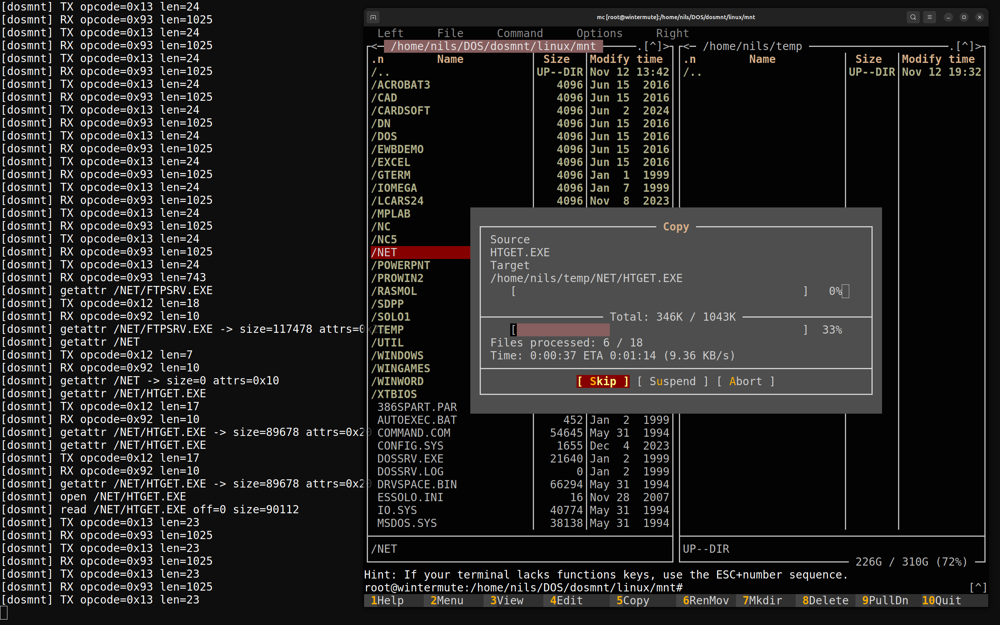

# DOS Serial Mount (dosmnt)

This project provides a minimal two-part setup that exposes a DOS machine's
filesystem to a Linux host over a plain RS-232 serial link.



* **DOS resident** (`dos/`): a tiny server that stays running on the DOS side,
  answers requests via COM1, and proxies them to the DOS file APIs.
* **Linux host** (`linux/`): a FUSE filesystem that connects to the DOS server,
  translates normal POSIX operations into serialized commands, and mounts the tree
  at any directory on the host. Reads and writes (including truncation) flow over
  the same serial link, so you can copy files both from and to the DOS machine.

## On-the-wire protocol

Messages travel in fixed frames so both sides can treat the serial link as a
byte stream. All multi-byte integers are little-endian.

```
Offset  Size  Field
------  ----  ---------------------------------------------------------
0       1     0xA5 preamble
1       1     0x5A preamble
2       1     Opcode (command or response)
3       1     Sequence (mirrored in responses)
4       2     Payload length (N)
6       N     Payload
6+N     1     Checksum: 8-bit sum of opcode, seq, len bytes, payload
```

Commands travel from Linux to DOS with opcodes in the `0x10-0x2F` range; DOS
responds with the same opcode plus `0x80`. All responses reserve the first byte
of their payload for a status code (`0` = success).

| Command | Payload (request)                                    | Payload (response)                                              |
| ------- | ----------------------------------------------------- | ---------------------------------------------------------------- |
| `0x10` (`HELLO`) | `uint8_t version`                                   | status, `uint8_t version`, `uint16_t flags`, 32-byte DOS label   |
| `0x11` (`LIST`)  | Zero-terminated DOS path                       | status, sequence of directory entry records                      |
| `0x12` (`STAT`)  | Zero-terminated DOS path                       | status, `struct FileInfo` (attributes, size, timestamps)         |
| `0x13` (`READ`)  | `uint32_t offset`, `uint16_t length`, path     | status, raw file bytes (length <= 1024)                          |
| `0x14` (`WRITE`) | `uint32_t offset`, `uint16_t length`, path, raw bytes | status only; data is written verbatim at the requested offset |
| `0x15` (`SETLEN`)| `uint32_t new_size`, path                      | status only (used for create/truncate)                           |
| `0x16` (`MKDIR`) | Zero-terminated DOS path                       | status only                                                      |
| `0x17` (`RMDIR`) | Zero-terminated DOS path                       | status only                                                      |
| `0x18` (`DELETE`)| Zero-terminated DOS path                       | status only (removes files)                                      |
| `0x1F` (`BYE`)   | none                                           | status only                                                      |

For `WRITE`, the payload mirrors `READ` with an additional data blob: the path
is zero-terminated, and the requested byte count immediately follows the string.
Directory entry records are packed as:

```
uint8_t  type      (0=file, 1=dir)
uint32_t size
uint32_t mtime_dos (packed DOS timestamp)
uint8_t  name_len
char     name[name_len] (no terminator, upper-case DOS 8.3 in current build)
```

## Building

### DOS side

The DOS server is written for a 16-bit memory model and builds cleanly with
Open Watcom 2.x:

```
cd dos
wmake
```

The resulting `DOSSRV.EXE` should be copied to the DOS machine. Loading it from
`AUTOEXEC.BAT` keeps it resident for the whole session.
At runtime you can point it at a different serial port or speed with
`-C COMx` and `-B baud` (for example, `DOSSRV -CCOM2 -B57600`).

### Linux side

The Linux host uses FUSE3 and POSIX termios. Make sure `libfuse3-dev` (or the
equivalent for your distribution) is installed, then:

```
cd linux
cmake -S . -B build
cmake --build build
sudo build/dosmnt --device /dev/ttyUSB0 --mount /mnt/dos --baud 115200
```

Unmount with `fusermount3 -u /mnt/dos` when done.

## Layout

```
common/    Shared headers (wire protocol)
dos/       DOS resident server source
linux/     Linux FUSE client
```

See the READMEs under each subdirectory for component-specific notes.
